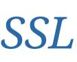

<div align="right">
  Language:
    🇺🇸
  <a title="Chinese" href="./README.zh-CN.md">🇨🇳</a>
</div>

 <div align="center"><a title="" href="https://github.com/ZJCV/SSL"></a></div>

<p align="center">
  «SSL» re-implements the paper <a title="" href="https://arxiv.org/abs/1608.03665">Learning Structured Sparsity in Deep Neural Networks</a>
<br>
<br>
  <a href="https://github.com/RichardLitt/standard-readme"></a>
  <a href="https://conventionalcommits.org"></a>
  <a href="http://commitizen.github.io/cz-cli/"></a>
</p>

## Table of Contents

- [Table of Contents](#table-of-contents)
- [Background](#background)
- [Installation](#installation)
- [Usage](#usage)
- [Maintainers](#maintainers)
- [Thanks](#thanks)
- [Contributing](#contributing)
- [License](#license)

## Background

Based on Group Lasso, SSL can achieve Filter/Channel/Filter Shape/Depth pruning.

## Installation

```
$ pip install -r requirements.txt
```

## Usage

First, you need set env for PYTHONPATH and CUDA_VISIBLE_DEVICES

```angular2html
$ export PYTHONPATH=<project root path>
$ export CUDA_VISIBLE_DEVICES=0
```

Then, begin `train-prune-finetuning`

* For train

```
$ python tools/train.py -cfg=configs/vggnet/vgg16_bn_cifar100_224_e100_sgd_mslr_ssl_filter_wise_1e_5.yaml
```

* For prune

```angular2html
$ python tools/prune/prune_vggnet.py
```

* For fine-tuning

```angular2html
$ python tools/train.py -cfg=configs/vggnet/refine_mean_abs_0_2_vgg16_bn_cifar100_224_e100_sgd_mslr_ssl_filter_wise_1e_5.yaml
```

Finally, set the fine-tuning model path in the PRELOADED option of the configuration file

```angular2html
$ python tools/test.py -cfg=configs/vggnet/refine_mean_abs_0_2_vgg16_bn_cifar100_224_e100_sgd_mslr_ssl_filter_wise_1e_5.yaml
```

## Maintainers

* zhujian - *Initial work* - [zjykzj](https://github.com/zjykzj)

## Thanks

* [lionminhu/structured-sparsity-learning](https://github.com/lionminhu/structured-sparsity-learning)

```
@misc{wen2016learning,
      title={Learning Structured Sparsity in Deep Neural Networks}, 
      author={Wei Wen and Chunpeng Wu and Yandan Wang and Yiran Chen and Hai Li},
      year={2016},
      eprint={1608.03665},
      archivePrefix={arXiv},
      primaryClass={cs.NE}
}
```

## Contributing

Anyone's participation is welcome! Open an [issue](https://github.com/ZJCV/SSL/issues) or submit PRs.

Small note:

* Git submission specifications should be complied
  with [Conventional Commits](https://www.conventionalcommits.org/en/v1.0.0-beta.4/)
* If versioned, please conform to the [Semantic Versioning 2.0.0](https://semver.org) specification
* If editing the README, please conform to the [standard-readme](https://github.com/RichardLitt/standard-readme)
  specification.

## License

[Apache License 2.0](LICENSE) © 2021 zjykzj